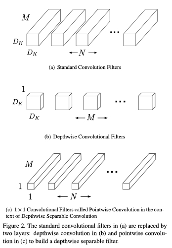
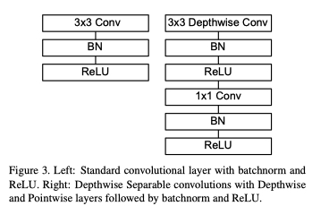
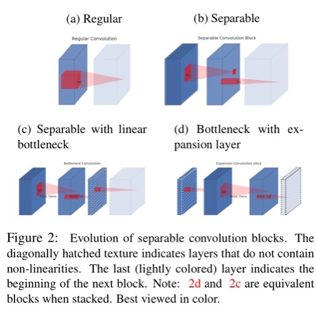
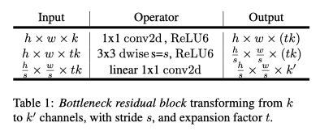
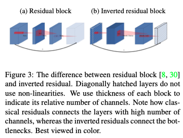

轻量级网络

## Mobile Net

Keypoints:

1. 将标准的卷积操作拆分成了Depthwise Convolution和Pointwise Convolution
2. 总结了神经网络宽度变化$\alpha$以及分辨率变化$\rho$对准确率的影响。此处暂且不讨论。

### 卷积拆分

模型size和计算量对比

|                  | Standard Convolution                           | Depthwise Convolution                   | Pointwise Convolution        |
| ---------------- | ---------------------------------------------- | --------------------------------------- | ---------------------------- |
| Kernel Size      | $D_K\times D_K\times M\times N$                | $D_K\times D_K \times  M$               | $M\times  N$                 |
| Computation Cost | $D_K\cdot D_K\cdot M\cdot N\cdot D_F\cdot D_F$ | $D_K\cdot D_K\cdot M\cdot D_F\cdot D_F$ | $M\cdot N\cdot D_F\cdot D_F$ |
| Ratio/standard   | 1                                              | $\frac{1}{N}$                           | $\frac{1}{D_K^2}$            |

相关公式:

Standard Convolution:

$\mathbf{G}_{k, l, n}=\sum_{i, j, m} \mathbf{K}_{i, j, m, n} \cdot \mathbf{F}_{k+i-1, l+j-1, m}$

Depthwise convolution:

$$\hat{\mathbf{G}}_{k,j,m}=\sum_{i,j}\hat{\mathbf{K}}_{i,j,m}\mathbf{F}_{k+i-1,l+j-1,m} $$

Pointwise convolution(1x1 Convolution):

$\mathbf{G}_{k,l,n}=\sum_{m} \hat{\mathbf{G}}_{k,l,m}\mathbf{K}_{m,n}$

Combination:

$\begin{aligned}
&\mathbf{G}_{k, l, n}=\sum_{m}\left(\sum_{i=1} \hat{\mathbf{K}}_{i, j, m} \cdot \mathbf{F}_{k+i-1,l+j-1,m}\right) \mathbf{K}_{m, n}\\
&=\sum_{m} \sum_{i,j}\left(\hat{\mathbf{K}}_{i,j,m} \mathbf{K}_{m, n}\right) \mathbf{F}_{k+i+1, l+j-1, m}
\end{aligned}$

理解：将Standard Convolution拆开实际上是一种解耦，认为使用

$\mathbf{K}_{i,j,m,n}=K(i,j,m,n)->K(i,j,m)\cdot K(m,n)=K_{i,j,m}\cdot K_{m,n}$

Kernel

关于模型的具体结构：

此处在Depthwise Conv和1x1 Conv后面添加了BN和ReLU，但在公式的拆分中没有体现，值得思考为何Depthwise之后也需要添加BN和ReLU。

## MobileNet2

MobileNetV2在V1的基础上进行了改进，主要提出了两种新的结构：Linear Bottlenecks, Invert Residuals.

### Linear Bottlenecks

首先注意到2个性质: 

1.  If the manifold of interest remains non-zero volume after ReLU transformation, it corresponds to a linear transformation. ReLU(x) = x, x>0

   当值大于0时，ReLU相当于线性

2. ReLU is capable of preserving complete information about the input manifold, but only if the input manifold lies in a low-dimensional subspace of the input space.

   当输入维度比较低的时候，ReLU可以保留较为完整的信息

   

   据此，在原先的结构中添加一层Linear Bottlenecks层: 将维度先压缩，然后再通过ReLU，再使用1x1卷积增维, 如下图所示。

模型结构:

### Inverted Residuals

在bottleneck处进行skip connection，内存消耗小，且在该论文的实验中效果稍好。

